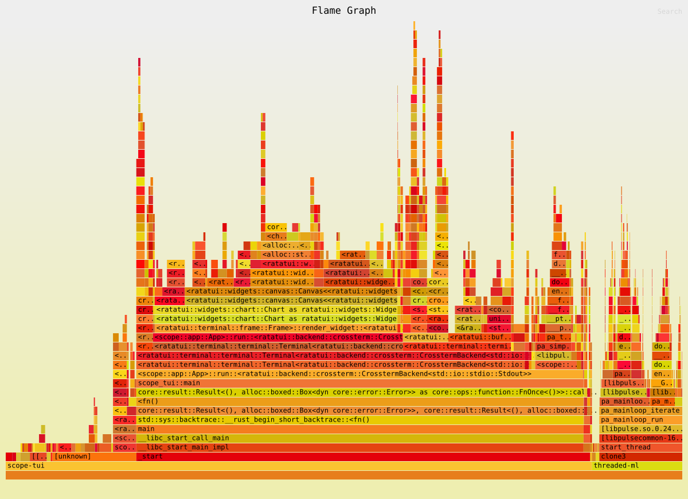
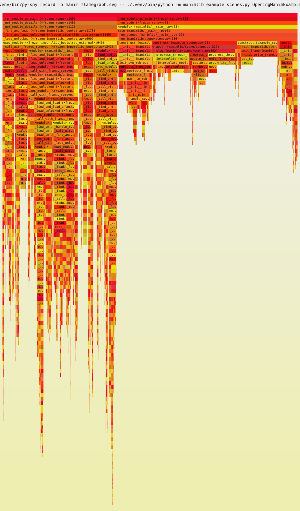

### Week08: Reflection

#### Profiling and fixing, while using a real debugger.

I really wanted to find a bottleneck bug, and held a hypothesis that I should
look in math related projects (such as the DSP project `scope-tui`), since that
would be an easy optimization, but I only managed to stumble upon a panic
(rust's equivalent of an unhandled exception) and just had to investigate. (You
can find my most notable attempts at finding a bottleneck in the flamegraph
section below.)

> I should add that the trickiest part of this bug was recreating it reliably.
> it only happens on certain compilation conditions, more detail can be found in
> the PR's description.

my initial instinct was to use valgrind (even though its a rust project), as it
usually prints very neat stack traces with minimal effort.

```bash
valgrind ./target/debug/scope-tui audio
==155889== Memcheck, a memory error detector
==155889== Copyright (C) 2002-2022, and GNU GPL'd, by Julian Seward et al.
==155889== Using Valgrind-3.19.0 and LibVEX; rerun with -h for copyright info
==155889== Command: ./target/debug/scope-tui audio
==155889== 

thread 'main' (155889) panicked at /home/dotacow/.cargo/registry/src/index.crates.io-1949cf8c6b5b557f/rustfft-6.3.0/src/common.rs:19:5: <-- stack trace stops here, we need to go deeper
Provided FFT buffer was too small. Expected len = 2048, got len = 512
==155889== 
==155889== HEAP SUMMARY:
==155889==     in use at exit: 144,620 bytes in 2,529 blocks
==155889==   total heap usage: 10,555 allocs, 8,026 frees, 31,445,560 bytes allocated
==155889== 
==155889== LEAK SUMMARY:
==155889==    definitely lost: 0 bytes in 0 blocks
==155889==    indirectly lost: 0 bytes in 0 blocks
==155889==      possibly lost: 78,152 bytes in 2,364 blocks
==155889==    still reachable: 66,468 bytes in 165 blocks
==155889==         suppressed: 0 bytes in 0 blocks
==155889== Rerun with --leak-check=full to see details of leaked memory
==155889== 
==155889== For lists of detected and suppressed errors, rerun with: -s
==155889== ERROR SUMMARY: 0 errors from 0 contexts (suppressed: 0 from 0)
```

so that wasn't very useful, it doesn't show the full stack trace, I am guessing
its because rust stack unwinding is different from C/C++. I had to bring out the
bigger guns and use gdb.

the cleaned up gdb profile is as follows:

```bash
rust-gdb --args ./target/debug/scope-tui audio

break rust_panic # breakpoint on panic
run # run and trigger panic
Thread 1 "scope-tui" hit Breakpoint 1, std::panicking::rust_panic ()
    at library/std/src/panicking.rs:886
886 let code = unsafe { __rust_start_panic(msg) };

backtrace # give me the stack details


#... stack noise
64>, f64> (self=0x5555563ad0a0, buffer=...)
    at /home/dotacow/.cargo/registry/src/index.crates.io-1949cf8c6b5b557f/rustfft-6.3.0/src/lib.rs:196 
#9  0x0000555555af5ae9 in scope::display::spectroscope::{impl#1}::process (self=0x7fffffffd528, 
    cfg=0x7fffffffcdb8, data=0x7fffffffcce0) at src/display/spectroscope.rs:163 # <--- this is the last line of the project's code before we transfer to the panic handler.
#... more stack noise
```

And by looking at the panic message we got initially
`Provided FFT buffer was too small. Expected len = 2048, got len = 512`, and by
heading over to that line of code, we can see that the fix is as simple as
zero-padding the buffer to the correct size.

this is I think a very neat use of debuggers, and really where they shine the
most, even though I can handle my way around a debugger, I still think that for
logic bugs, you are best using the plain old print debugging methodology, but
for this state-based memory/crash bugs, a debugger actually saves time rather
than being a hindrance.

[I opened a PR to patch my fix in.](https://github.com/alemidev/scope-tui/pull/24)

#### Finding an N+1

I was unable to find an N+1 in time, but it is definitely something I will keep
an eye out for in the future.

#### Reading 3 real flame graphs

#### attempt 1:

 I found this
[very cool project](https://github.com/alemidev/scope-tui) and assumed it must
have some heavy math in the background, so my initial instinct was to profile it
and hopefully fix a bottlneck, but it is actually quite optimized, and most of
the heavy blocks are UI rendering blocks (which I don't think need
optimization). I ended up profiling a panic based bug, which I covered earlier.

#### attempt 2:

 I next wanted to profile a
parsing project, so I turned to
[rust-fmt](https://github.com/rust-lang/rustfmt), and ran `cargo fmt --check` on
the largest repo I could find, which was the rust analyzer repo. I wont even
attempt to debug this monster myself, but this graph helps me see that the
program mainly spends its time in the `walk_mod_items` function (49.3% of the
samples), and the `visit_crate` functions. from this view, I can infer that the
`walk_mod_items` function visits the functions, code blocks, statements, while
the `visit_crate` constructs an ast formed from submodules (i.e. forming a
directory tree of the project)

one hell of a pretty graph though.

#### attempt 3:

 enough rust & C graphs now, I
want to take a look at a higher level language. lets use `py-spy`.

I always enjoyed the content of 3b1b, and the engine he uses to animate his
videos is called `manim`, and it's open source. Lets profile it.

here we can see that the main lifetime of the program is spent mainly in the
`play` function, which seems to be alternating between `ineterpolate` and
`progress_through_animations` and `update_frame`.

the flame graph is also "polluted" by initalizing dependencies, in fact, it was
almost a 50/50 (60/40 to be exact) split between our program and the initalizing
dependencies stage.

digging deeper into the graph, we can see that `interpolate_mobject` is
iterating over a potentially large list of objects, and performing an operation
which could be vectorized via NumPy and potentially take advantage of SIMD
instructions.
