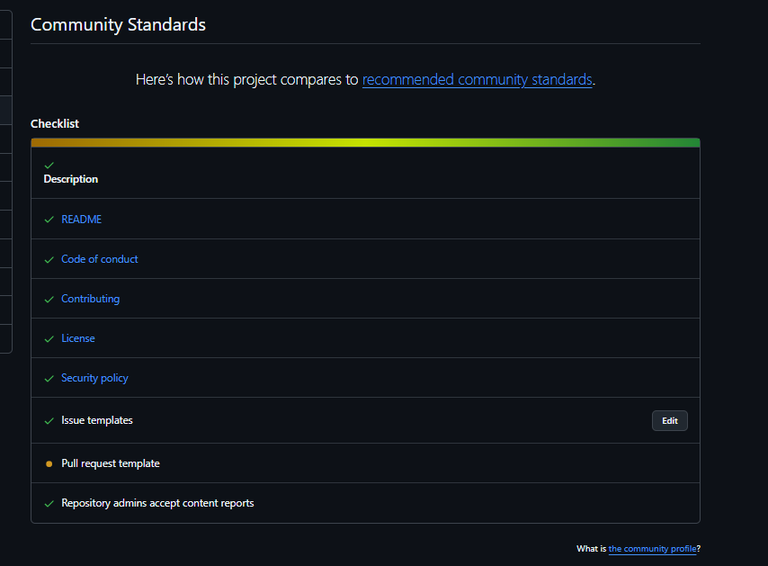

### week09: reflection

The two repositories I worked focused on this week were
[esp-csi-tui-rs](https://github.com/42-DDN/esp-csi-tui-rs) and [tbd]

#### esp-csi-tui-rs

**License:**

I choose the apache license for this project, because I know I wanted a
permissive license, and I favored it over the MIT license because it is more
modern and has a patent retaliation cluase.

**Community Standards & CONTRIBUTING.md:**

I went over the checklist and made sure that the repository was compliant with
the community standards (I added a PR template but it is not being picked up for
some reason) I also added a
CONTRIBUTING.md

**Governance:** I also added the governance file, and it is a simple one, but I
can see how useful it is for large projects such as the rust language for
example.

#### Audit and Contribute:

I wanted to contribute to the ratatui project this week, and this is my initial
audit:

- They have fully completed the community standards checklist
- They use the MIT license.
- They allow AI generated contributions, but it must meet the same standards as
  human contributions, and the code must be compatible with the license, as well
  as be fully disclosed.
- They have a local CI runner in the form of `cargo xtask ci`
- They use commit signing
- They have a very neat
  [ARCHITECTURE.md](https://github.com/ratatui/ratatui/blob/main/ARCHITECTURE.md)

//WIP

#### Other stuff

Last week I was able to experience the feeling of reviewing an
[entierly AI-generated PR](https://github.com/csi-rs/esp-csi-rs/pull/19), the
thing is it was a genuinely useful PR, but it kinda freaked me out as it was
opened within 2 hours of the related issue being opened 0_0
