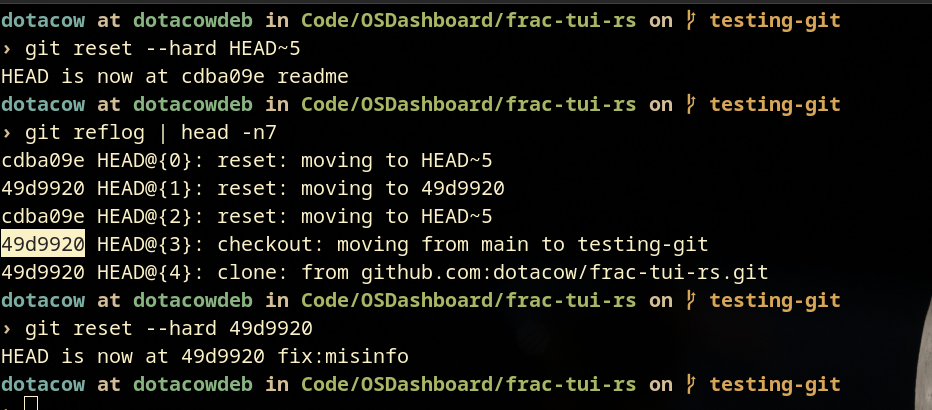

# Git Archaeology Reflection

I used `git log` to find an interesting commit, I then proceeded to
`git cat-file -p` my way to a blob (commit -> tree -> blob), the most
interesting thing I noticed was just how obvious that the same guy who created
linux also created git, and how he likes treating his filesystems as files. it
really reminded me of the `/proc` filesystem, which isn't a content-addressable
filesystem like git, but rather a virtual filesystem that provides an interface
to processes and other kernel info.

# Reflog Rescue Drill

# Refactor Commit History

squashed a redundant commit, and reworded 2 others, I elected to force push
rather than creating a PR as it's a solo project repo.
[the 7 commits commited on May 12 are the commits involved in the rebase](https://github.com/dotacow/frac-tui-rs/commits/main/)
